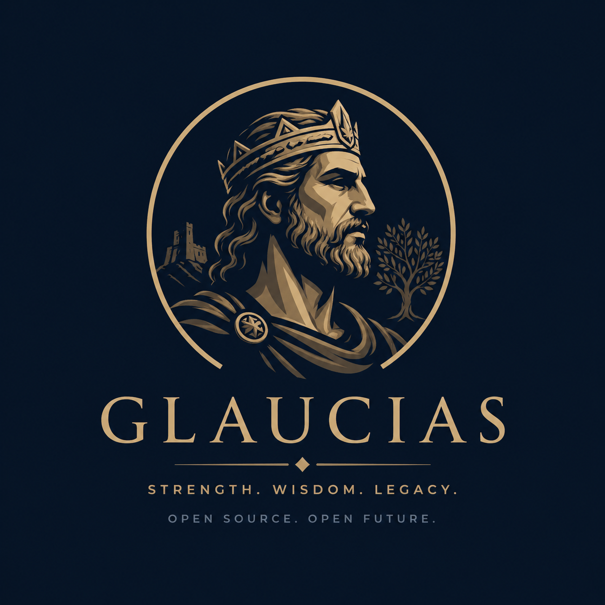
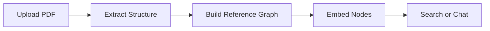
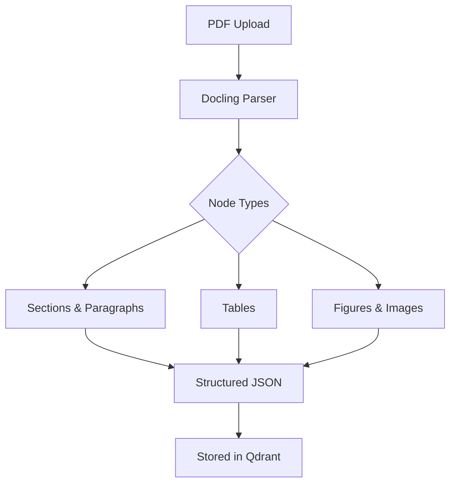
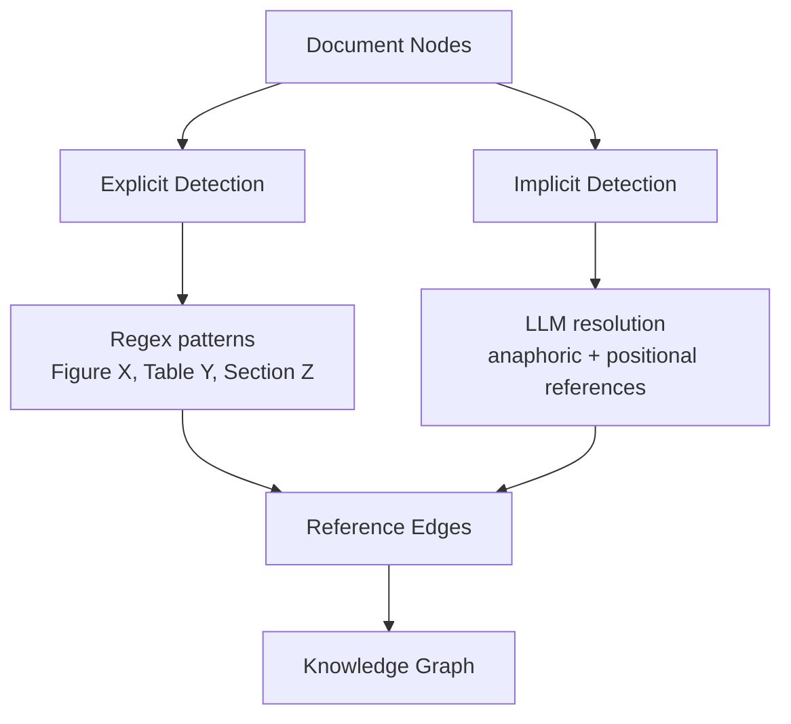
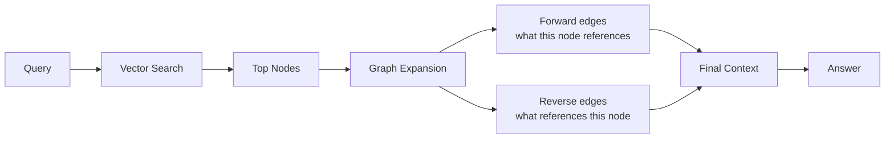
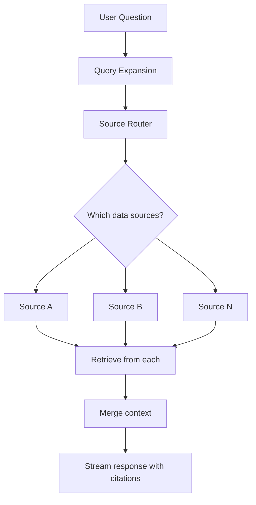

<div align="center">
  
  <h1>Glaucias</h1>
  <p>A platform for turning PDFs into structured, searchable knowledge.</p>
</div>

---

## What is it

Glaucias is an open source RAG platform. The core idea is that most RAG pipelines treat documents as flat chunks of text, which loses a lot of the structure that is actually in the document. Glaucias parses PDFs and keeps that structure intact, sections, subsections, tables, figures, and the references between them.

It also finds the connections between parts of a document. Things like "as shown in Figure 3" or "refer to Section 2.1" are resolved into actual graph edges. This means when you query the document, the retrieval can follow those connections instead of just returning the closest text chunks.

---

## How it works



---

## The main flows

### 1. Document extraction

When you upload a PDF, Glaucias breaks it down into nodes. Each node is a piece of the document: a section, a paragraph, a table, a figure. The structure is preserved so you can see exactly how the document is organized.



---

### 2. Reference graph

After extraction, Glaucias goes through the document and finds references between nodes. There are two kinds:

**Explicit** references are things like "Figure 3", "Table 1", "Section 4.2". These are found with pattern matching.

**Implicit** references are things like "as mentioned above" or "the following example". These are resolved by an LLM that reads the context and figures out what is being pointed to.



You can also add or remove edges manually in the UI.

---

### 3. Search within a document

When you query a document, Glaucias does a vector search over the nodes. It then expands the results by following the reference graph, so if the most relevant node references a figure or another section, those are pulled in too.



---

### 4. Chat across multiple documents

The chat feature lets you talk to multiple documents at once. When you ask a question, the system first figures out which documents are relevant to the query, then retrieves from those and generates a streamed response with citations.



---

## Screenshots

> TODO: Add a screenshot of the document view here

<!--  -->

> TODO: Add a screenshot of the reference graph here

<!--  -->

> TODO: Add a screenshot of the chat interface here

<!--  -->

---

## Demo

> TODO: Add a demo video here

<!-- [](media/demo.mp4) -->

---

## Setup

### Backend

```bash
cd backend
pip install -r requirements.txt
cp .example.env .env
# fill in your API keys in .env
python api.py
```

### Frontend

```bash
cd frontend
npm install
npm run dev
```

---

## Stack

**Backend** — Python, Flask, Docling, Qdrant, LangChain, OpenAI API

**Frontend** — React, Vite, TailwindCSS

**Storage** — Qdrant for vectors, JSON files for metadata and graphs
